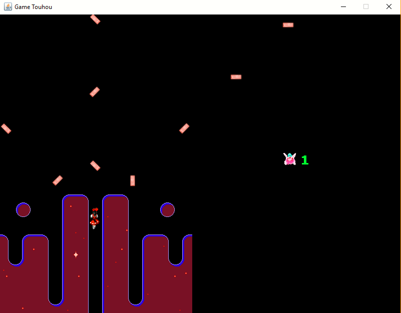

## TechKids - Code Intensive -  
### Khởi tạo 3 ArrayList: top, mid, bot chứa các GameObject tương ứng sẽ render ở các lớp.

1. Khai báo 3 `ArrayList` tên lần lượt là `topLayer`, `midLayer`, `botLayer` trong `GameObject`.
<pre>
public class GameObject {
    ...
    public static ArrayList<GameObject> topLayer = new ArrayList<>();
    public static ArrayList<GameObject> midLayer = new ArrayList<>();
    public static ArrayList<GameObject> botLayer = new ArrayList<>();
    ...
}
</pre>

2. Chạy chương trình.

Chú ý:

* Do hiện nay game vẫn đang render đúng 1 layer. Vì vậy mà đạn đã chèn hẳn lên cả phần menu game chứa score của người chơi.

* Khi thực hiện xong việc render 3 layer thay vì 1 layer, khi đó layer dưới cùng là `botLayer` sẽ chứa các `gameobject` là background của `GameWelcomScene` và `GameOverScene`. Layer trên cùng là `topLayer` sẽ chứa `gameobject` là background của menu game chứa score của người chơi. Và layer còn lại `midLayer` sẽ chứa các `gameobject` còn lại (`Player`, `Enemy`, `PlayerBullet`...)

3. Thực hiện việc render theo từng lớp.

* Trước tiên cần xóa hết code trong hàm `renderAll()`. Xóa hết các phần code ở dưới.

<pre>
public static void renderAll(Graphics g) {
    for (int i = 0; i < gameObjects.size(); i++) {
        GameObject gameObject = gameObjects.get(i);
        if(gameObject.active) {
            gameObject.render(g);
        }
    }
}
</pre>

* Sau đó duyệt 3 ArrayList `topLayer`, `midLayer`, `botLayer` rồi chạy hàm `render()` của từng `gameobject` chứa trong từng layer.

<pre>
public static void renderAll(Graphics g) {
        for (int i = 0; i < botLayer.size(); i++) {
            GameObject gameObject = botLayer.get(i);
            if(gameObject.active) {
                gameObject.render(g);
            }
        }
        for (int i = 0; i < midLayer.size(); i++) {
            GameObject gameObject = midLayer.get(i);
            if(gameObject.active) {
                gameObject.render(g);
            }
        }
        for (int i = 0; i < topLayer.size(); i++) {
            GameObject gameObject = topLayer.get(i);
            if(gameObject.active) {
                gameObject.render(g);
            }
        }
    }

</pre>

Chú ý:
* Thứ tự của 3 vòng for ảnh hưởng đến việc render, cần render theo thứ tự bot -> mid -> top.

4. Clear 3 ArrayList mỗi khi chuyển scene trong hàm `clearAll()` trong `GameObject`

<pre>
public static void clearAll() {
        ...
        topLayer.clear();
        midLayer.clear();
        botLayer.clear();
    }
</pre>

*Tiếp theo [Add các gameobject tương ứng vào từng layer](ci2.md)*

