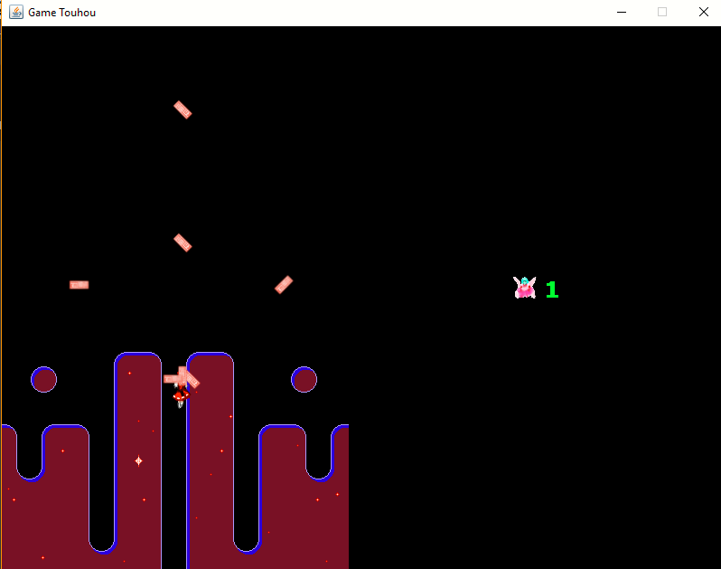

## TechKids - Code Intensive -  
### Add các gameobject tương ứng vào từng layer.

1. Add `Player`, `Enemy`, `PlayerBullet`, `EnemyExplosion` vào `midLayer`.

* Add `Player`: Vào trong hàm tạo của `Player()` và thực hiện việc `add()`
<pre>
public Player() {
        ...
        GameObject.midLayer.add(this);
    }
</pre>

* Tương tự với `Enemy`, `PlayerBullet` và `EnemyExplosion`
<pre>
public Enemy() {
        ...
        GameObject.midLayer.add(this);
    }
</pre>

<pre>
public PlayerBullet() {
       ...
        GameObject.midLayer.add(this);
    }
</pre>

<pre>
public EnemyExplosion() {
        ...
        GameObject.midLayer.add(this);
    }
</pre>

2.  Add background menu chứa score và score của player vào `topLayer` ở hàm tạo `BackGroundMenu()` và `ScoreMenu()`
<pre>
public BackgroundMenu() {
        ...
        GameObject.topLayer.add(this);
    }
</pre>

<pre>
public ScoreMenu() {
        ...
        GameObject.topLayer.add(this);
    }
</pre>

3.  Add background của WelcomScene, GameOverScene và background của cả game vào `botLayer` trong hàm tạo `BackgroundWelcomeScene()` và `BackgroundGameOverScene()` và `BackGround()`

<pre>
public BackgroundWelcomeScene() {
        ...
        GameObject.botLayer.add(this);
    }

</pre>

<pre>
public BackgroundGameOverScene() {
        ...
        GameObject.botLayer.add(this);
    }
</pre>

<pre>
public Background() {
        ...
        GameObject.botLayer.add(this);
    }
</pre>

4. Chạy chương trình

* Kết quả nhận được là các gameobject đã được render thành 3 layer. 
* Như trên hình: đạn của player đã không còn bị đè lên background của menu vì background của menu thuộc về topLayer

